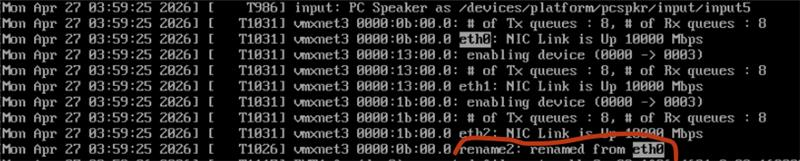
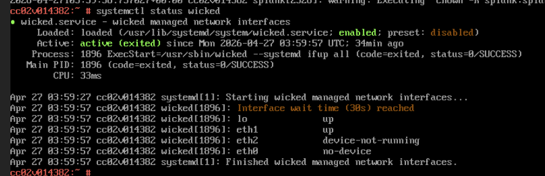
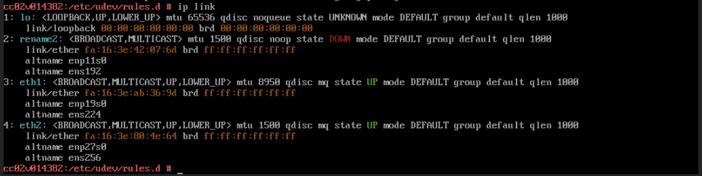

import TrackLink from '@site/src/components/TrackLink';
import PostEngagement from '@site/src/components/PostEngagement';

Related references:

- <TrackLink to="https://kubernetes.io/docs/tasks/access-application-cluster/create-external-load-balancer/" postSlug="CloudProvider">Kubernetes External LoadBalancer docs</TrackLink>
- <TrackLink to="https://kubernetes.io/docs/tutorials/services/source-ip/" postSlug="CloudProvider">Kubernetes source IP tutorial</TrackLink>

---

## Engagement

<PostEngagement postId="VM NIC Get Swapped" />