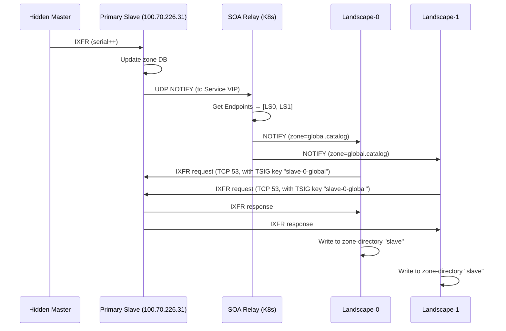

#### Landscape DNS Solution


> Scope For POC: ? 


Questions:
1. Landscape DNS or Delegation go first ?
2. Replacement of `dns-api ls add <view> Rescursor's FIP` ? 
    - Service Discovery
3. Will VM based primary slave be re-used in DNS LS containerized solution ? 
4. How long does it take for initial sync from `SOA relay Pod (K8S primary slave)`
5. TO-DO: How does CIEA utilize Oasis for DNS communications ?? SSH is weak ?? 
6. Why don't we leverage Bind native zone transfer feature but relyig on SOA on-time notify to each individual pod with VM Primary slave + K8S landscape Pod ? 

Note: the logging part depends on `rsyslog` won't work anyhow therefore `landcape-slave-update-bind-config` can't be re-used anyway. 

Design:
1. Mirror Go solution to what `/usr/bin/dns-api-landscape-slave-update-bind-config` && `dns-api-sshwrapper`does from `LS` to achieve the followings
    - Retrieve TSIG Key over Hashicorp Vault VSO/VSS 
    - Management of
        - `allownotify.conf`, 
        - `catalog.conf`, 
        - `catalog-options.conf`, 
        - `control-options.conf` 
        - `keys.conf`
2. Using Oasis for communication ? 
3. Self-healing Go program to probe the change and make change upon a specified timeframe.
4. Using statefulset instead of deployment even though landscape slave is aimed to be stateless due to the following reasons.
        - Fast bootstrap a Pod from scratch by re-using the Storage. In our case it is cinder volume
        - Mitigate the impact while upgrading
        - 
5. Dockerfile
        - Use VOLUME 
                - for persistence, 有 VOLUME：即使你忘了挂载，Docker 也会在宿主机上自动创建一个匿名卷（Anonymous Volume）。当你删除容器时，这个匿名卷依然存在于宿主机的磁盘上（通常在 /var/lib/docker/volumes/ 下），你可以找回数据。
                - `kubectl inspec` for operational people to persist the data
6. Helm Charts
7. ONLY Configure landscape slave `catalog-zones { zone "global.catalog" { type slave; ... default-masters { ip }}`  造成只有两种拉zone的结果
        - 初始启动 (`AXFR`) + `SOA` refresh timer (3600s)to check `serial number`
        - 手动触发: `rndc refresh`

```
📉 直接后果：同步延迟 = SOA refresh interval
假设 Primary Slave 上 global.catalog 的 SOA 记录为：
global.catalog.  3600  IN  SOA  ns1.example.com. hostmaster.example.com. (
                               2025122601 ; serial
                               3600       ; refresh  ← 关键！
                               900        ; retry
                               604800     ; expire
                               86400 )    ; minimum

你在 10:00:00 在 Hidden Master 更新 zone → Primary Slave 10:00:01 完成 IXFR
Landscape Slave 不会立刻感知
它会在 10:00:01 + 3600s = 11:00:01 才轮询检查 SOA
若发现 serial 更新，才发起 IXFR
→ 最大延迟 = refresh 秒（通常 30m~2h）

场景
用户/系统感知
DNS 记录新增（如新 service）
新服务1 小时内无法解析 → 业务失败
故障切换（failover IP）
切换后长时间返回旧 IP → 流量黑洞
安全响应（删除恶意记录）
恶意记录持续生效至 refresh → 延长攻击窗口
```

8. VM + Kubernetes 复合DNS环境解决方案 -> SOA Relay Pod 

```
为什么额外还需要 SOA Notify Relay Pod？
🤔 你可能想：既然 Landscape 能靠轮询同步，为何还要复杂 Relay？
Hidden Master
     │
     ↓ (NOTIFY + IXFR)
Primary Slave (VM)
     │
     ├─(NOTIFY)─→ Landscape Pod-0 ✅ （若直接 also-notify pod-0）
     ├─(NOTIFY)─→ Landscape Pod-1 ✅
     └─(NOTIFY)─→ Landscape Pod-2 ✅

But in Kubernetes:

Primary Slave
     │
     ↓ (NOTIFY to Service VIP)
Service (LoadBalancer)
     │
     └─(UDP packet)─→ ONLY ONE Pod (e.g., Pod-0) ❌
```




Security:
        - Follow SGS Container application guideline https://wiki.one.int.sap/wiki/spaces/itsec/pages/2004546670/How+to+develop+a+secure+Container+Application+-+Best+Practice

Scalability:
- HPA
- 

Storage:
- EmptyDir 
- PVC (Cinder)
- NFS (No)


#### View TSIG Key Management from DNS-API Solution - Tech Arch
```
# 【当前】 Key 通过HiddenPrimary Systemd Timer来调用 sshwrapper 来更新bind配置

dns-api-check-slaves (hiddenmaster)
  └─> SSH 执行 "newkey $key $fname" (在 landscape slave 上)
      └─> dns-api-sshwrapper 处理 "newkey" 命令
          └─> sudo dns-api-landscape-slave-update-bind-config


# Source: /usr/bin/dns-api-check-slaves running from HM
# To-do: 添加hashicorp vault的逻辑， 在保留原有
sub scp_key_to_server {
        my ($server, $key, $keydata) = @_;
        my $fh = File::Temp->new(TEMPLATE => "tempXXXXXX", SUFFIX => ".key");
        my $fname = $fh->filename;
        $fh->autoflush;
        print $fh $keydata;
        # FIXME: accept-new is available only on newer SSH clients
        run_with_timeout($TIMEOUT, \&run_local, "scp -q -o StrictHostKeyChecking=no -i $dnsapiuser_key_file $fname $dnsapiuser\@$server:");
        if ($@) {
                warn "w: copying key $key to server $server: $@";
                return undef;
        }
        return $fname;
}

在 hiddenmaster 上执行 dns-api view add <VIEW> 时，会自动创建两个 key：
sub _create {
    my ($self, $name) = @_;
    local $ENV{PATH} .= ':/usr/local/sbin:/usr/sbin:/sbin';
    open(my $keygen, '-|', 'tsig-keygen', $name) or die;
    my $key = do { local $/ = undef; <$keygen> };
    close($keygen) or die "$0: tsig-keygen: $!\n";
    return $key;
}


#  rpm -qf /usr/sbin/ddns-confgen  # THis prove the importance of bind-utils from DHS HP server
bind-utils-9.11.22-3.65.1.x86_64

(dnshm01-sit|dnshm-sit) vsa11829647:~ #
#   ls -l /usr/sbin/tsig-keygen
lrwxrwxrwx 1 root root 12 Nov  7 23:28 /usr/sbin/tsig-keygen -> ddns-confgen


```

### Containerized Solution Design


在kubernetes 中我希望通过服务发现来实现实时动态获取 bind master server的 IP 以及hashicorp中的vault的信息 来比对 对应catalog zone master IP 以及TSIG key是否有更新 ，在k8s 中如何设计，使用一个无限循环的sider car是否是最佳方案 ？

GPT answer:
```
在 Kubernetes 中，通过服务发现实时同步 BIND Master IP 和 HashiCorp Vault 信息的场景，使用简单的无线循环 Sidecar 并非“最佳”方案。

虽然 Sidecar 模式可以工作，但它存在资源浪费、缺乏集群级可见性、以及生命周期耦合等痛点。针对你的需求，我建议采用更符合 Kubernetes 原生哲学的 Operator 模式，或者优化后的 Sidecar 结合 Agent 方案。

1. 为什么“无限循环 Sidecar”不是最优解？
资源碎片化： 如果你部署了 100 个 Pod，就会有 100 个 Sidecar 都在独立跑循环去请求 Vault 和 K8S API，这会给服务端造成不必要的压力。

状态不一致： 每个 Sidecar 的轮询周期可能错开，导致不同 Pod 看到的数据在短时间内不一致。

缺乏容错和审计： 脚本式的循环很难处理复杂的重试策略、指数退避和变更审计。

2. 推荐方案：Kubernetes Operator 模式
这是目前最专业的设计，利用 控制循环 (Control Loop) 实现“观察 -> 差异比对 -> 执行”：

设计架构：
自定义控制器 (Controller)： 编写一个运行在集群内的 Controller（可以使用 Operator SDK）。

监听服务发现 (K8S API)： Controller 通过 Informer 机制监听 BIND 服务对应的 Endpoints 或 Service。只要 Master Pod 的 IP 发生偏移（如重启、迁移），Controller 会立即收到通知。

监听 Vault 更新： Controller 通过 Vault 的 API 定期刷新或使用 Vault 的 AppRole 维持长连接，监控 TSIG key 的路径。

原子化同步： Controller 将比对结果直接更新到特定的 ConfigMap 或 Secret 中，或者通过 API 直接下发给 BIND 实例。

优势： 全局只有一个实例在做决策，效率最高，且符合 K8S 声明式理念。

3. 如果必须使用 Sidecar：推荐的“进阶版”
如果你觉得写 Operator 太重，必须用 Sidecar，建议引入成熟的工具来代替自写脚本：

方案 A：Vault Agent Sidecar (HashiCorp 官方推荐)
不要自己写循环请求 Vault。

使用 Vault Agent 作为 Sidecar。

它支持 template 功能：你可以定义一个模板文件。当 Vault 中的 Secret 发生变化时，Vault Agent 会自动拉取新值并重新渲染本地文件。

它可以配合 consul-template 监控 DNS 或其他服务发现的变更。

方案 B：Reloader + ConfigMap
写一个全局的任务（如 CronJob 或单实例 Deployment）去比对 IP 和 Vault 信息。

如果发现差异，更新一个 K8S ConfigMap。

利用社区开源的 Reloader 探测到 ConfigMap 变化后，自动对 BIND 的 Pod 执行滚动更新或通过信号量（SIGHUP）通知 Pod 重新加载配置。
https://github.com/stakater/Reloader


```

已知的坑
1. `/var/lib/named/dns-api/named.conf.include` will be updated when adding a new `view` by rendering `/etc/dns-api/templates/primaryslave/named.conf.include.tt`. You must double check after initial setup. 

可取之处
1. 在修改`/etc/dns-api/templates/primaryslave/named.conf.include.tt` 中的 `master IP`后的下一次更新hm `check-slave` 运行会自动修正整个`named.conf.include`中的配置

```
view "global" {
        masterfile-format text;
        match-clients {
                "slaves-global"; // downstream
        };

        server 100.70.226.118 { keys "slave-0-global"; };

        // Downstream LS need notification and AXFR
        notify explicit;

        server 100.70.226.131 { keys "slave-0-global"; };
        server 100.70.226.148 { keys "slave-0-global"; };
        server 100.70.226.92 { keys "slave-0-global"; };
        also-notify {
                100.70.226.131;
                100.70.226.148;
                100.70.226.92;
        };
        ...

        catalog-zones {
                zone "global.catalog"
                zone-directory "slave"
                default-masters { 100.70.226.118; };
        };

        zone "global.catalog" {
                type slave;
                masters { 100.70.226.118; };
                file "slave/global.catalog";
        };
};
```


#### Evaluations
1. 

#### Hands-On practice

```
25-Dec-2025 04:42:47.864 transfer of 'dnshm-sit-cis-testing1.local/IN' from 100.70.226.41#53: Transfer completed: 1 messages, 10 records, 487 bytes, 0.001 secs (487000 bytes/sec) (serial 7)
25-Dec-2025 04:42:47.964 zone testzone/IN: Transfer started.
25-Dec-2025 04:42:47.964 zone dnshm-sit-cis-testing.local/IN: Transfer started.
25-Dec-2025 04:42:47.964 zone test086.local/IN: zone transfer deferred due to quota
25-Dec-2025 04:42:47.964 zone test082.local/IN: zone transfer deferred due to quota
25-Dec-2025 04:42:47.964 zone test087.local/IN: zone transfer deferred due to quota
25-Dec-2025 04:42:47.964 zone test084.local/IN: zone transfer deferred due to quota
25-Dec-2025 04:42:47.964 transfer of 'dnshm-sit-cis-testing.local/IN' from 100.70.226.41#53: connected using 100.70.226.41#53 TSIG slave-0-global

TO-DO: evaluate performance improvements

options {
    # 允许同时接收的最大区域传输数（建议根据区域数量调大，例如 100）
    transfers-in 100;

    # 允许从同一个 Master 同时传输的区域数（从 2 调大到 20）
    transfers-per-ns 20;

    # 限制并发阶段的数量，避免瞬间压力过大
    transfers-per-in 20;
    
    # 提高查询刷新序列号的速率
    serial-query-rate 50;
};
rndc reload

使用 rndc 强制触发同步
# 重新触发所有从区域的刷新检查
rndc retransfer <zone_name>   # 针对特定区域
# 或者通过以下命令尝试刷新所有过期或需要更新的区域
rndc refresh
rndc status
```

2. 

```
25-Dec-2025 04:24:30.998 k8s/catalog-options.conf:14: catz: zone-directory 'slave' not found; zone files will not be saved
25-Dec-2025 04:24:30.998 k8s/catalog-options.conf:20: catz: zone-directory 'slave' not found; zone files will not be saved
```