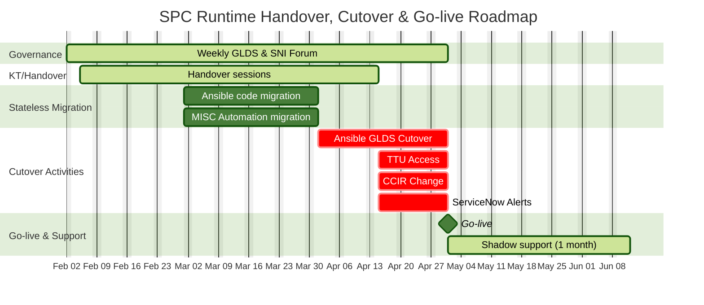

https://mermaid.ai/docs/mermaid-oss/syntax/gantt.html#section-statements

https://mermaid.ai/app/projects/6add848a-d7a6-4115-aa30-ac1cce6de894/diagrams/4ef50062-5378-4308-ba33-f45f36581a47/version/v0.1/edit 

