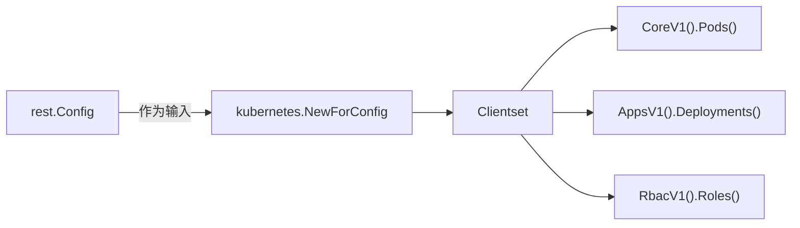

# K8S.IO Client-Go SDK

## K8S.IO Client-Go Kubernetes - 高层类型化客户端（Clientset）

基于 `rest.Config`，提供类型安全、面向 Kubernetes 原生 API 对象的高层客户端接口，即 Clientset
- 自动生成对所有 Kubernetes 内置 API 组（如 `core/v1`, `apps/v1`, `rbac/v1` 等）的访问方法
- 每个 API 组对应一个“typed client”，例如：
```go
clientset.CoreV1().Pods("default").Get(ctx, "my-pod", metav1.GetOptions{})
clientset.AppsV1().Deployments("default").List(ctx, opts)
clientset.RbacV1().Roles("kube-system").Create(ctx, role, opts)
```
🛠️ 关键函数
`kubernetes.NewForConfig(*rest.Config) (*kubernetes.Clientset, error)`
这是最常用的入口：传入 `rest.Config`，返回完整的类型化客户端。

🗂️ 包结构特点
- `kubernetes/typed/<group>/<version>/`：每个 API 组版本都有对应的生成代码（如 `core/v1`, `apps/v1`）
支持 fake 客户端（用于单元测试）：`kubernetes/fake`

> ✅ 本质：`kubernetes.Clientset` 是开发者日常操作 Pod、Service、Deployment 等资源的主力工具。

#### MISC:

`clientset, err := kubernetes.NewForConfig(config)`
`*kubernetes.Clientset` 是 Kubernetes 官方 Go 语言客户端（client-go）中最核心的对象。它具备了对 Kubernetes 内置资源进行全生命周期管理（CRUD）的能力

clientset 包含了对 Kubernetes 各个 API 组（API Groups）的访问接口。通过它，你可以操作以下常见资源：

- Core (v1)：操作 Pods, Services, ConfigMaps, Secrets, Namespaces, Nodes, PersistentVolumes 等。
- Apps (v1)：操作 Deployments, StatefulSets, DaemonSets, ReplicaSets 等。
- Batch (v1)：操作 Jobs, CronJobs。
- Networking (v1)：操作 Ingress, NetworkPolicies。
- Rbac (v1)：操作 Roles, RoleBindings, ClusterRoles 等。


假设你已经拿到了 clientset，你可以像这样获取 default 命名空间下的所有 Pod
```golang
// 访问 CoreV1 组下的 Pods 资源
pods, err := clientset.CoreV1().Pods("default").List(context.TODO(), metav1.ListOptions{})
if err != nil {
    panic(err)
}

for _, pod := range pods.Items {
    fmt.Printf("Pod 名称: %s\n", pod.Name)
}
```

## K8S.IO Client-Go REST - 底层通信基础

> 核心作用: 提供与kubernetes API Server 直接通信所需的底层配置和传输机制。 其
- 它定义了Kubernetes API Server直接通信所需的底层配置和传输机制
- 封装了：
  - API Server 地址(Host)
  - TLS配置（CA 证书、 客户端证书/密钥 或 Token）
  - 身份认证方式（Bearer Token、 TLS Client Cert、 Exec Plugin等）
  - 超时、 QPS限流、 内容类型（如 Protobuf/JSON）等网络参数

关键函数
- `rest.InClusterConfig()`: 自动从Pod内部获取ServiceAccount Token 和 CA，构建集群内配置。
- `clientcmd.BuildConfigFromFlags(...)` (在`tools/clientcmd` 包中)： 从kubeconfig文件构建配置（用于集群外）

> 本质: `rest.Config` 是所有Kubernetes客户端的“连接凭证 + 网络设置”

🎯 使用场景
- 当你需要直接构造底层客户端（如自定义资源、非标准 API）
- 编写 Operator / Controller 的底层框架
- 需要精细控制 HTTP 行为（如重试、超时、代理）

`InClusterConfig()` 是 Kubernetes 官方 Go 客户端库（即 `client-go`）中的一个函数，用于**在 Pod 内部自动获取访问 Kubernetes API Server 所需的配置信息**。

---

### 中文解释如下：

```go
func InClusterConfig() (*Config, error)
```

- **作用**：  
  返回一个 `*rest.Config` 对象（注意：这里的 `Config` 是 `k8s.io/client-go/rest` 包中的配置结构，不是 Zap 或其他库的 Config），该对象封装了在 Kubernetes 集群内部（即在一个 Pod 中）调用 Kubernetes API 所需的身份认证和连接信息。

- **使用场景**：  
  当你的程序作为一个 **Pod 运行在 Kubernetes 集群中**，并且需要与 Kubernetes API Server 通信（例如创建 Pod、查询 Service、监听事件等），就可以调用此函数自动获取配置，无需手动提供 kubeconfig 文件。

- **工作原理**：  
  Kubernetes 会自动为每个 Pod 注入以下内容：
  - 一个 **ServiceAccount Token**（位于 `/var/run/secrets/kubernetes.io/serviceaccount/token`）
  - 一个 **CA 证书**（位于 `/var/run/secrets/kubernetes.io/serviceaccount/ca.crt`）
  - 一个环境变量 `KUBERNETES_SERVICE_HOST` 和 `KUBERNETES_SERVICE_PORT`，指向 API Server 地址

  `InClusterConfig()` 会读取这些文件和环境变量，自动构建出包含：
  - API Server 地址（如 `https://10.96.0.1:443`）
  - TLS CA 证书（用于验证 API Server 身份）
  - Bearer Token（用于身份认证）

  的 `rest.Config` 对象。

- **错误情况**：  
  如果该函数被**在集群外部调用**（例如在本地开发机上运行），由于缺少上述注入的文件和环境变量，它会返回一个特定的错误：  
  ```go
  ErrNotInCluster
  ```
  表示“当前进程不在 Kubernetes 集群环境中”。

---

### 典型使用示例：

```go
import (
    "k8s.io/client-go/kubernetes"
    "k8s.io/client-go/rest"
)

func main() {
    // 自动获取集群内配置
    config, err := rest.InClusterConfig()
    if err != nil {
        panic(err) // 如果不在集群内，这里会报错
    }

    // 使用 config 创建 clientset
    clientset, err := kubernetes.NewForConfig(config)
    if err != nil {
        panic(err)
    }

    // 现在可以用 clientset 操作 Kubernetes API
    pods, err := clientset.CoreV1().Pods("default").List(context.TODO(), metav1.ListOptions{})
    // ...
}
```

---

### 对比：集群外使用

在本地开发时，通常使用 `clientcmd.BuildConfigFromFlags("", kubeconfigPath)` 来加载 `~/.kube/config` 文件。而 `InClusterConfig()` 是其“集群内版本”，专为 Pod 设计，更安全、更自动化。

---

### 总结

> `InClusterConfig()` 是 Kubernetes Go 客户端中用于 **在 Pod 内自动获取 API 访问凭证和连接信息** 的标准方法。它依赖 Kubernetes 自动注入的 ServiceAccount 机制，是编写 Operator、Controller 或任何需要访问 K8s API 的容器化应用的基础。

## REST 和 Kubernetes的关系



- 先通过 rest 包（或 clientcmd）获得 *rest.Config
- 将该 config 传给 kubernetes.NewForConfig()
- 得到 *kubernetes.Clientset
- 通过 clientset 调用具体资源的操作（Get/List/Create/Update/Delete）