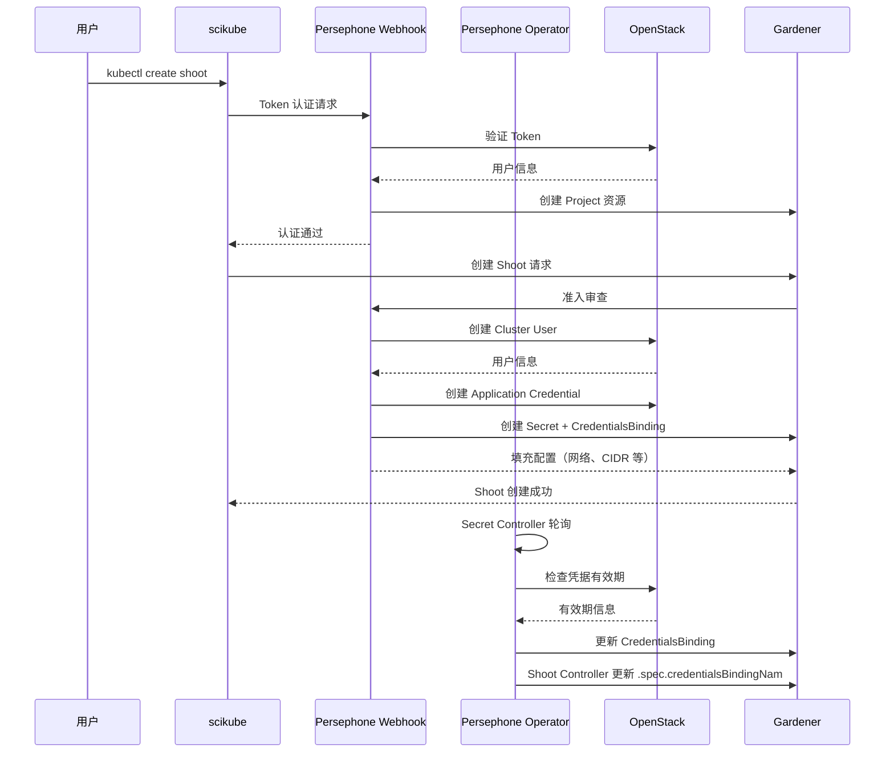

```
Persephone 是 SAP Cloud Infrastructure 提供的 Kubernetes 即服务平台（KaaS），基于 Gardener 构建，用于自动化管理
OpenStack 云基础设施上的 Kubernetes 集群。

 ┌─────────────────────────────────────────────────────────────────┐
  │                    Persephone System                       │
  ├─────────────────┬───────────────────┬──────────────────────┤
  │  scikube CLI    │  Operator        │  Webhook           │
  │  (客户端工具)   │  (控制器)        │  (准入控制)        │
  ├─────────────────┴───────────────────┴──────────────────────┤
  │                  Gardener (K8s 管理平台)                 │
  ├─────────────────────────────────────────────────────────────────┤
  │                  OpenStack (云基础设施)                    │
  └─────────────────────────────────────────────────────────────────┘
```
## 🔧 主要组件详解

### 1. scikube CLI ( cmd/scikube/ )

用户端工具，提供三个核心命令：

  scikube auth                    # kubectl 认证插件
  scikube kubeconfig-for-garden   # 生成 Garden 集群 kubeconfig
  scikube kubeconfig-for-shoot    # 生成 Shoot 集群 kubeconfig

核心实现 ( cmd/scikube/cmd/auth.go ):

• 使用 OpenStack Keystone 进行身份认证
• 支持 Application Credentials 和 Password 两种认证方式
• 实现凭据缓存机制（文件存储，权限 0600）
• 生成格式： region:tokenID  或  tokenID

认证流程 ( internal/auth/auth.go ):
```
  // 1. 从缓存读取凭据（优先）
  cachedCred, err := cacheStorage.Read(cacheKey)

  // 2. 如果缓存过期/不存在，重新认证
  providerClient := openstack.AuthenticatedClient(ctx, authOptions)
  token := tokens.Create(ctx, identityClient, &authOptions)

  // 3. 构建 Kubernetes ExecCredential
  cred := &v1.ExecCredential{
      Status: &v1.ExecCredentialStatus{
          Token: bearerToken,           // region:tokenID
          ExpirationTimestamp: expiresAt,
      },
  }
```




Auth.go

```
kubectl
   │
   │ 需要认证
   ▼
exec plugin (你的程序)
   │
   │ 生成 ExecCredential
   ▼
stdout 输出 JSON
   │
   ▼
kubectl 读取 JSON
   │
   │ 使用 Token 或证书
   ▼
访问 apiserver

# 缓存只是插在中间：
kubectl
   │
   ▼
exec plugin
   │
   ├─ 读缓存
   │     │
   │     ├─ 有效 → 直接输出
   │     └─ 过期 → 重新生成
   │
   ▼
stdout JSON


让我通过完整的认证链路来解析 OpenStack 认证与 kubectl 集成的实现逻辑和设计思想。

--------

## 📊 完整认证流程图

  ┌─────────────────────────────────────────────────────────────────────────────────┐
  │                        认证链路全景图                                  │
  └─────────────────────────────────────────────────────────────────────────────────┘

    用户                   kubectl                    kubeconfig                   scikube CLI
     │                        │                            │                          │
     │  kubectl get pods      │                            │                          │
     ├───────────────────────>│                            │                          │
     │                        │  读取 kubeconfig             │                          │
     │                        │<───────────────────────────┤                          │
     │                        │                            │                          │
     │                        │ 发现 exec credential plugin  │                          │
     │                        ├───────────────────────────>│                          │
     │                        │   调用: scikube auth     │                          │
     │                        │   传递环境变量              │                          │
     │                        │   (OS_AUTH_URL, etc.)     │                          │
     │                        │                            │                          │
     │                        │                            │                          │
     │                        │                            │  1. 检查缓存         │
     │                        │                            │     ↓                   │
     │                        │                            │  2. 读取缓存          │
     │                        │                            │     ↓                   │
     │                        │                            │  3. 验证过期        │
     │                        │                            │     ↓                   │
     │                        │                            │  4. 如果有效，返回    │
     │                        │<───────────────────────────┤                          │
     │                        │   缓存命中                 │                          │
     │                        │   返回 ExecCredential      │                          │
     │                        │                            │                          │
     │                        │  [缓存未命中/过期]         │                          │
     │                        ├───────────────────────────>│                          │
     │                        │                            │  5. OpenStack 认证   │
     │                        │                            │     ↓                   │
     │                        │                            │  6. 提取 Token        │
     │                        │                            │     ↓                   │
     │                        │                            │  7. 添加 Region 前缀 │
     │                        │                            │     ↓                   │
     │                        │                            │  8. 构造 ExecCred    │
     │                        │<───────────────────────────┤                          │
     │                        │   返回 ExecCredential      │                          │
     │                        │                            │                          │
     │                        │  解析 ExecCredential        │                          │
     │                        │  提取 Bearer Token        │                          │
     │                        │                          │                          │
     │  [携带 Token 的请求]   │                          │                          │
     │<────────────────────────┤                          │                          │
     │                        │                          │                          │
     │                        ▼                          │                          │
     │  ┌────────────────────────────────────────────────────────────┐
     │  │            Kubernetes API Server                         │
     │  │                                                         │
     │  │  Token 认证失败（自定义 Token 格式:region:tokenID）     │
     │  │  触发 Token Review Webhook                              │
     │  └─────────────────────────┬───────────────────────────────┘
     │                            │
     │  ┌─────────────────────────▼────────────────────────────────┐
     │  │         Persephone Token Webhook (服务端)               │
     │  │                                                        │
     │  │  1. 解析 Token (region:tokenID)                       │
     │  │  2. 使用 tokenID 调用 Keystone                       │
     │  │  3. 验证 Token 有效性                                   │
     │  │  4. 提取用户/项目/角色信息                              │
     │  │  5. 构造 Kubernetes UserInfo                             │
     │  │  6. [可选] 自动创建 Gardener Project 资源              │
     │  └─────────────────────────┬────────────────────────────────┘
     │                            │
     │  验证通过，返回 UserInfo       │
     │<───────────────────────────┤
     │                        │
     │  ┌─────────────────────────▼────────────────────────────────┐
     │  │         Kubernetes API Server (继续)                    │
     │  │                                                        │
     │  │  验证 RBAC 权限                                       │
     │  │  执行用户请求                                          │
     │  │  返回结果                                            │
     │  └─────────────────────────┬────────────────────────────────┘
     │                            │
     │  返回 pods 列表             │
     │<───────────────────────────┤
     │


```