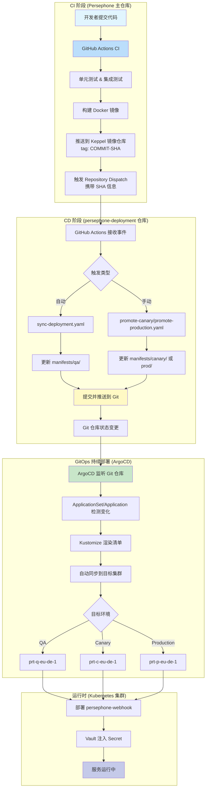
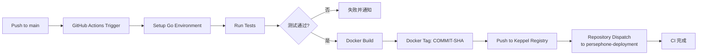
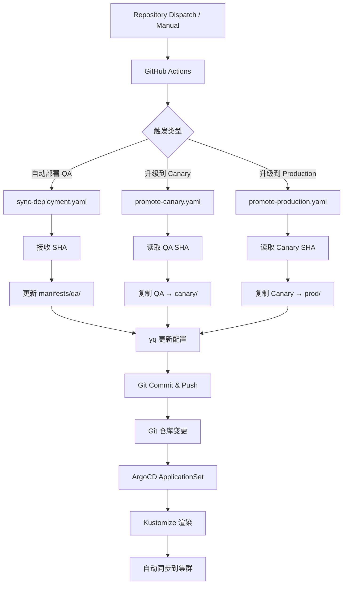
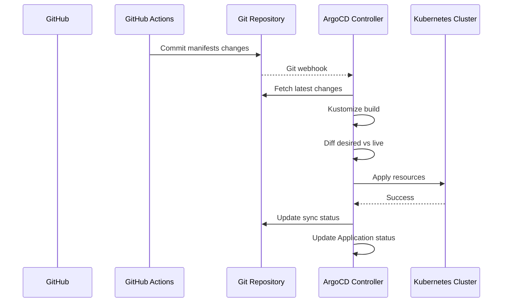
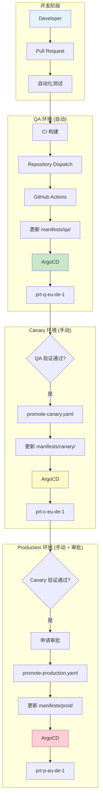
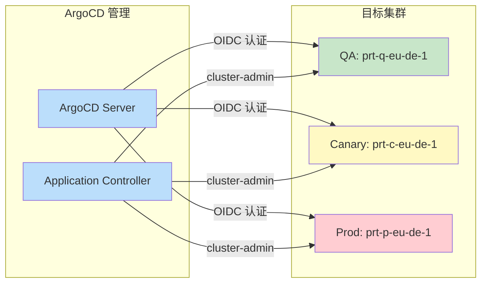
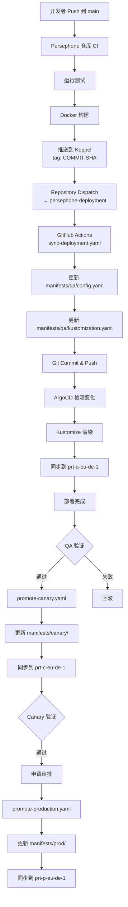

# Persephone Deployment 企业级 CI/CD 架构解析

## 架构符合性分析

**✅ 符合企业级 CI → GitHub → ArgoCD 架构**

该仓库采用了经典的 **CI/CD 分离架构**，通过 **GitHub Repository Dispatch** 连接两个仓库，实现完整的自动化流水线。

---

## 完整架构图



---

## CI 阶段详细解析

### 架构位置
**执行仓库**: Persephone 主仓库 (`sap-cloud-infrastructure/persephone`)

### CI 流程图



### 关键配置

#### 1. Docker 构建策略
**文件位置**: Persephone 主仓库

```dockerfile
# 多阶段构建
FROM golang:1.24.5-alpine3.22 AS builder
RUN make -C /src install PREFIX=/pkg

FROM alpine:3.22
COPY --from=builder /pkg/ /usr/
ENTRYPOINT [ "/usr/bin/webhook" ]

# 元数据标签
LABEL org.opencontainers.image.revision=${BININFO_COMMIT_HASH}
LABEL org.opencontainers.image.version=${BININFO_VERSION}
```

**关键特性**:
- ✅ 使用 Commit SHA 作为镜像标签（可追溯）
- ✅ 多阶段构建减少镜像体积
- ✅ 非特权用户运行（USER 4200:4200）

#### 2. 镜像推送
**目标仓库**: `keppel.eu-de-1.cloud.sap/persephone/gardener-customer-webhook:<COMMIT-SHA>`

**标签策略**:
```bash
# 示例
keppel.eu-de-1.cloud.sap/persephone/gardener-customer-webhook:49233aae5417d562a7675104f8237a00dc24d252
```

#### 3. Repository Dispatch 触发
**事件发送**:
```yaml
# Persephone 仓库的 GitHub Actions
- name: Trigger deployment repo
  run: |
    gh api \
      --method POST \
      -H "Accept: application/vnd.github.v3+json" \
      /repos/sap-cloud-infrastructure/persephone-deployment/dispatches \
      -f event_type=deployment-params \
      -f client_payload[sha]="${{ github.sha }}" \
      -f client_payload[ref]="${{ github.ref }}"
```

**接收端配置**: `.github/workflows/sync-deployment.yaml:8`
```yaml
on:
  repository_dispatch:
    types: [deployment-params]
```

---

## CD 阶段详细解析

### 架构位置
**执行仓库**: persephone-deployment 仓库

### CD 流程图



### 核心组件详解

#### 1. GitHub Actions 工作流

##### (a) QA 自动部署工作流
**文件**: `.github/workflows/sync-deployment.yaml`

**触发条件**:
```yaml
on:
  repository_dispatch:      # CI 自动触发
    types: [deployment-params]
  workflow_dispatch:        # 手动触发
    inputs:
      sha_commit: "SHA hash commit"
```

**核心步骤**:

```yaml
# Step 1: 检出代码
- name: Checkout deployment repo
  uses: actions/checkout@v5
  with:
    ref: main
    fetch-depth: 0  # 完整历史

# Step 2: 更新 config.yaml
- name: Update image version
  run: |
    yq e '.data.image = "keppel.eu-de-1.cloud.sap/persephone/gardener-customer-webhook:${{ env.IMAGE_SHA }}"' \
      -i argocd/manifests/qa/config.yaml
    yq e '.data.version = "${{ env.IMAGE_SHA }}"' -i argocd/manifests/qa/config.yaml
    yq e '.data.deployed-at = "'$(date -u +%Y-%m-%dT%H:%M:%SZ)'"' -i argocd/manifests/qa/config.yaml

# Step 3: 更新 kustomization.yaml
- name: Update remote resource references
  run: |
    # 更新远程资源引用到具体 SHA
    yq e '.resources[1] = "https://github.wdf.sap.corp/sap-cloud-infrastructure/persephone/config/environments/qa?ref=${{ env.IMAGE_SHA }}"' \
      -i argocd/manifests/qa/kustomization.yaml

    # 添加镜像覆盖
    yq e '.images[0].name = "keppel.eu-de-1.cloud.sap/ccloud/persephone/persephone"' \
      -i argocd/manifests/qa/kustomization.yaml
    yq e '.images[0].newTag = "${{ env.IMAGE_SHA }}"' \
      -i argocd/manifests/qa/kustomization.yaml

# Step 4: 提交并推送
- name: Commit and push
  run: |
    git add argocd/manifests/qa/
    git commit -m "Deploy persephone with image tag $(echo ${{ env.IMAGE_SHA }} | cut -c 1-6)"
    git push
```

**输出示例**:
```yaml
# argocd/manifests/qa/config.yaml
apiVersion: v1
kind: ConfigMap
metadata:
  name: persephone-info
data:
  image: keppel.eu-de-1.cloud.sap/persephone/gardener-customer-webhook:49233aae5417d562a7675104f8237a00dc24d252
  version: 49233aae5417d562a7675104f8237a00dc24d252
  deployed-at: "2026-02-17T10:30:00Z"
  source-ref: refs/heads/main
```

##### (b) 环境升级工作流
**文件**: `.github/workflows/promote-canary.yaml`

**关键逻辑**:
```bash
# 读取 QA 环境的 SHA
QA_IMAGE_SHA=$(yq e '.images[0].newTag' argocd/manifests/qa/kustomization.yaml)

# 复制配置
cp argocd/manifests/qa/config.yaml argocd/manifests/canary/config.yaml
cp argocd/manifests/qa/kustomization.yaml argocd/manifests/canary/kustomization.yaml

# 更新环境特定配置
yq e '.data.environment = "canary"' -i argocd/manifests/canary/config.yaml
yq e '.data.cluster = "prt-c-eu-de-1"' -i argocd/manifests/canary/config.yaml

# 更新远程资源引用
yq e '.resources[1] = "https://github.wdf.sap.corp/sap-cloud-infrastructure/persephone/config/environments/canary?ref=${{ env.IMAGE_SHA }}"' \
  -i argocd/manifests/canary/kustomization.yaml
```

#### 2. ArgoCD ApplicationSet

**文件**: `argocd/AppSets/persephone-appset.yaml`

**架构优势**:
```yaml
apiVersion: argoproj.io/v1alpha1
kind: ApplicationSet
metadata:
  name: persephone
spec:
  generators:
    - list:
        elements:
          - environment: qa
            cluster: prt-q-eu-de-1
          # canary & prod 暂时注释，逐步启用

  template:
    spec:
      project: "persephone"
      source:
        repoURL: https://github.wdf.sap.corp/sap-cloud-infrastructure/persephone-deployment
        path: 'argocd/manifests/{{environment}}'
        targetRevision: main
      destination:
        name: '{{cluster}}'
        namespace: "persephone"

      # Vault Secret 管理
      ignoreDifferences:
        - group: ""
          kind: Secret
          name: persephone-config-operator
          jsonPointers: ["/data/config.yaml"]
        - group: ""
          kind: Secret
          name: persephone-config-webhook
          jsonPointers: ["/data/config.yaml"]

      # 自动同步策略
      syncPolicy:
        automated:
          enabled: true
          selfHeal: true
          prune: true
```

**关键特性**:
| 特性 | 说明 | 企业级价值 |
|------|------|-----------|
| **单一配置源** | 一个文件管理所有环境 | 减少配置漂移 |
| **自动同步** | Git 变更 → 集群自动更新 | 提高部署效率 |
| **自我修复** | 检测到不一致自动修复 | 提高系统稳定性 |
| **Secret 忽略** | 避免 Vault Secret 持续漂移 | 简化运维 |

#### 3. Kustomize 配置

**文件**: `argocd/manifests/<env>/kustomization.yaml`

```yaml
resources:
  - config.yaml  # 本地元数据

  # 远程资源引用（关键设计）
  - https://github.wdf.sap.corp/sap-cloud-infrastructure/persephone/config/environments/qa?ref=<SHA>

images:
  - name: keppel.eu-de-1.cloud.sap/ccloud/persephone/persephone
    newTag: <commit-sha>  # 覆盖镜像标签
```

**设计优势**:
- ✅ **版本强关联**: 部署清单与代码版本完全一致
- ✅ **配置可追溯**: 每个部署记录对应具体代码版本
- ✅ **环境隔离**: 不同环境使用不同的配置目录
- ✅ **远程引用**: 从主仓库拉取配置，保持单一真实来源

---

## GitOps 持续部署架构

### ArgoCD 自动同步流程



### 部署环境架构



### 集群访问架构



**集群凭证配置**: `clusters/prt-q-eu-de-1.yaml`
```yaml
apiVersion: v1
kind: Secret
metadata:
  labels:
    argocd.argoproj.io/secret-type: cluster
  name: prt-q-eu-de-1
  namespace: containers
stringData:
  config: |
    {
      "execProviderConfig": {
        "command": "bash",
        "args": ["-c", "echo -n '{\"apiVersion\":\"client.authentication.k8s.io/v1\",\"kind\":\"ExecCredential\",\"status\":{\"token\":\"'; cat /var/run/secrets/tokens/argocd-openid-token; echo -n '\"}}'"]
      },
      "tlsClientConfig": {
        "caData": "..."
      }
    }
  server: "https://api.prt-q-eu-de-1.prt-q.external.mgmt-eu-de-1.soil-garden.eu-de-1.cloud.sap"
```

---

## 企业级特性评估

| 特性 | 实现方式 | 评估 |
|------|---------|------|
| **CI/CD 分离** | CI 在主仓库，CD 在部署仓库 | ✅ 清晰的职责分离 |
| **版本可追溯** | Commit SHA 作为镜像标签和远程资源引用 | ✅ 完整的追溯链 |
| **多环境支持** | 独立的配置目录 + ApplicationSet | ✅ 灵活的环境管理 |
| **自动化部署** | Repository Dispatch + ArgoCD 自动同步 | ✅ 全流程自动化 |
| **审批流程** | 手动触发 + 环境升级工作流 | ✅ 支持审批机制 |
| **回滚能力** | Git 历史回溯 + 重新部署 | ✅ 快速回滚 |
| **Secret 管理** | Vault 注入 + ignoreDifferences 配置 | ✅ 安全可靠 |
| **监控告警** | ArgoCD UI + GitHub Actions 日志 | ✅ 可观测性 |
| **安全合规** | OIDC 认证 + RBAC 权限 | ✅ 企业级安全 |
| **可扩展性** | ApplicationSet 模板化配置 | ✅ 易于扩展 |

---

## 完整端到端流程

### 1. 开发 → 部署全流程



### 2. 关键时间节点

| 阶段 | 耗时 | 触发方式 | 自动化程度 |
|------|------|---------|-----------|
| CI 构建 | ~5-10 分钟 | Push to main | 100% 自动 |
| QA 部署 | ~2-5 分钟 | Repository Dispatch | 100% 自动 |
| Canary 升级 | ~2-5 分钟 | 手动触发 | 90% 自动 |
| Production 升级 | ~2-5 分钟 | 手动 + 审批 | 80% 自动 |
| 回滚 | ~2-5 分钟 | 手动触发 | 100% 自动 |

---

## 总结

该架构 **完全符合企业级 CI → GitHub → ArgoCD 标准**，具备以下核心优势：

### ✅ 符合企业级标准
1. **CI/CD 清晰分离**: 两个仓库各司其职
2. **GitOps 完整实现**: 单一真实来源，声明式配置
3. **多环境流水线**: QA → Canary → Production 标准流程
4. **版本精确控制**: Commit SHA 全链路追踪
5. **安全可靠**: OIDC 认证 + Vault 集成 + RBAC

### 🚀 创新点
1. **双仓库架构**: 应用代码与部署配置分离
2. **Repository Dispatch**: 跨仓库自动化触发
3. **远程资源引用**: 配置与代码版本强绑定
4. **ApplicationSet**: 统一管理多环境应用

### 📊 可观测性
- ArgoCD UI: 实时监控应用状态
- GitHub Actions: 完整的部署历史
- Git 提交记录: 完整的变更追溯

这是一个**生产就绪**的企业级 CI/CD 架构，可以直接用于大规模生产环境。

---

## 附录：关键文件清单

### CI 阶段（Persephone 主仓库）
- `Dockerfile` - Docker 镜像构建配置
- `.github/workflows/ci.yml` - CI 构建和测试工作流
- `.github/workflows/deploy.yml` - 镜像推送和 Repository Dispatch 触发

### CD 阶段（persephone-deployment 仓库）
- `.github/workflows/sync-deployment.yaml` - QA 自动部署
- `.github/workflows/promote-canary.yaml` - QA → Canary 升级
- `.github/workflows/promote-production.yaml` - Canary → Production 升级
- `.github/workflows/force-sync-secret.yaml` - 强制同步 Vault Secret

### ArgoCD 配置
- `argocd/AppSets/persephone-appset.yaml` - ApplicationSet 定义
- `argocd/Applications/qa/application.yaml` - QA Application
- `argocd/Applications/canary/application.yaml` - Canary Application
- `argocd/Applications/prod/application.yaml` - Production Application
- `argocd/manifests/<env>/config.yaml` - 环境配置
- `argocd/manifests/<env>/kustomization.yaml` - Kustomize 配置

### 集群配置
- `bootstrap/01-project.yaml` - ArgoCD Project
- `bootstrap/02-cluster-app.yaml` - 集群应用
- `bootstrap/04-persephone-argo-crb.yaml` - RBAC 权限
- `clusters/prt-q-eu-de-1.yaml` - QA 集群凭证

### 相关资源
- **ArgoCD UI**: https://containers.dev.gitops.shoot.live.k8s-hana.ondemand.com/applications
- **Persephone 主仓库**: https://github.wdf.sap.corp/sap-cloud-infrastructure/persephone
- **镜像仓库**: keppel.eu-de-1.cloud.sap/ccloud/persephone/persephone
