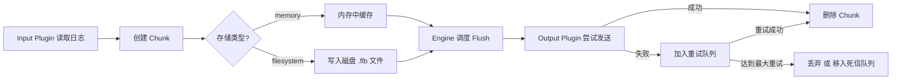

Work notes:

```
helm show values fluent-bit --version 0.52.0 --repo https://fluent.github.io/helm-charts
```

SNI Fluentbit
https://github.tools.ppp/sni-helm-charts/sidevops-fluent-bit/blob/main/values.yaml

CIEA Fluentbit: https://github.tools.ppp/cia-helm-charts/fluentbit/blob/main/templates/fluentbit-config.yaml


https://github.tools.ppp/SIDEVOPS/sidevops-canary-sni-turing/blob/main/argocd/helm_charts/monitoring/fluent-bit/values.yaml


Technical Reference:
https://docs.fluentbit.io/manual/administration/configuring-fluent-bit/classic-mode/configuration-file

