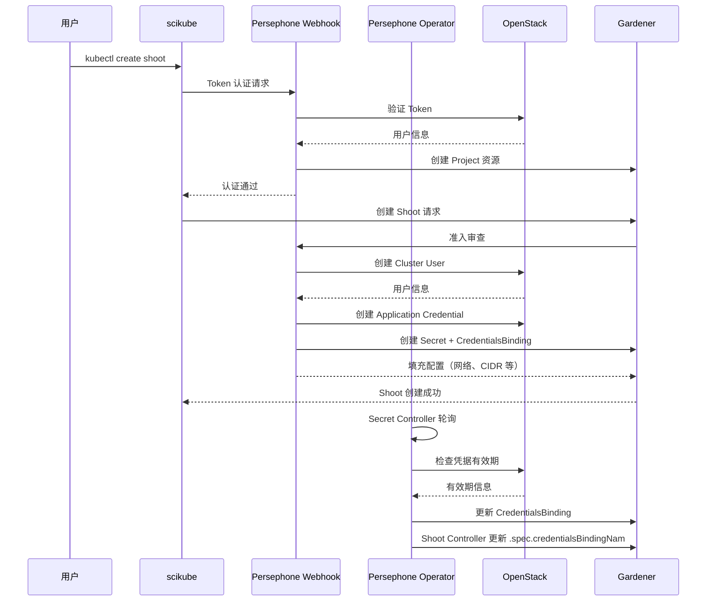

```
Persephone 是 SAP Cloud Infrastructure 提供的 Kubernetes 即服务平台（KaaS），基于 Gardener 构建，用于自动化管理
OpenStack 云基础设施上的 Kubernetes 集群。

 ┌─────────────────────────────────────────────────────────────────┐
  │                    Persephone System                       │
  ├─────────────────┬───────────────────┬──────────────────────┤
  │  scikube CLI    │  Operator        │  Webhook           │
  │  (客户端工具)   │  (控制器)        │  (准入控制)        │
  ├─────────────────┴───────────────────┴──────────────────────┤
  │                  Gardener (K8s 管理平台)                 │
  ├─────────────────────────────────────────────────────────────────┤
  │                  OpenStack (云基础设施)                    │
  └─────────────────────────────────────────────────────────────────┘
```
## 🔧 主要组件详解

### 1. scikube CLI ( cmd/scikube/ )

用户端工具，提供三个核心命令：

  scikube auth                    # kubectl 认证插件
  scikube kubeconfig-for-garden   # 生成 Garden 集群 kubeconfig
  scikube kubeconfig-for-shoot    # 生成 Shoot 集群 kubeconfig

核心实现 ( cmd/scikube/cmd/auth.go ):

• 使用 OpenStack Keystone 进行身份认证
• 支持 Application Credentials 和 Password 两种认证方式
• 实现凭据缓存机制（文件存储，权限 0600）
• 生成格式： region:tokenID  或  tokenID

认证流程 ( internal/auth/auth.go ):
```
  // 1. 从缓存读取凭据（优先）
  cachedCred, err := cacheStorage.Read(cacheKey)

  // 2. 如果缓存过期/不存在，重新认证
  providerClient := openstack.AuthenticatedClient(ctx, authOptions)
  token := tokens.Create(ctx, identityClient, &authOptions)

  // 3. 构建 Kubernetes ExecCredential
  cred := &v1.ExecCredential{
      Status: &v1.ExecCredentialStatus{
          Token: bearerToken,           // region:tokenID
          ExpirationTimestamp: expiresAt,
      },
  }
```


