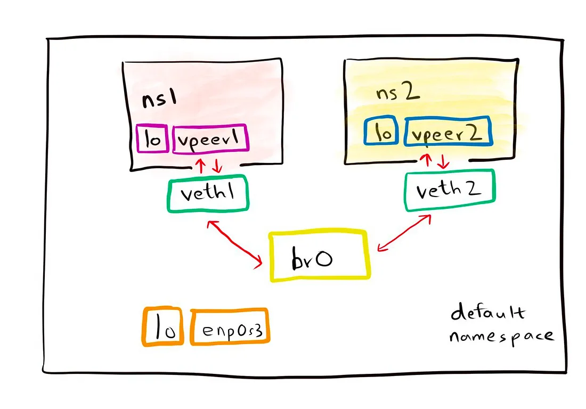

#### Networking fundamental concepts:
- LAN
- VLAN
- WAN
- Linux vnet
- Linux bridge network: 工作在数据链路层（Layer2）的虚拟交换机
- Switch交换机
    - 数据链路层(Lay2 mostly)
    - Maintain a MAC address/forwarding table
- CNI(K8S)：Container Network Interface

Others:
- 帧（Frame） 是数据链路层传输的基本单位, OSI七层模型中的数据链路层使用的术语，对应于网络层的“数据包（packet）”、传输层的“段（segment）” 
    - 以太网帧的结构 `| 前导码 | 目标MAC地址 | 源MAC地址 | 类型 | 数据 | FCS |`

 #### Picture of container to container communication
