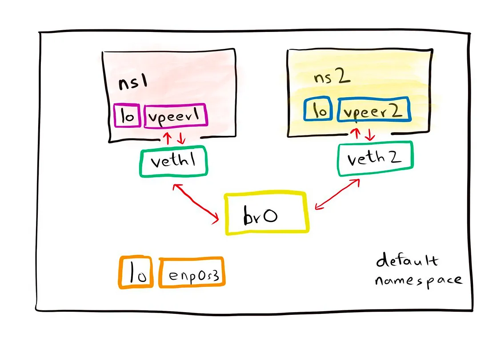

### Networking fundamental concepts:
- LAN
- VLAN
- WAN
- Linux vnet
- Linux bridge network: 工作在数据链路层（Layer2）的虚拟交换机
- Switch交换机
    - 数据链路层(Lay2 mostly)
    - Maintain a MAC address/forwarding table
- CNI(K8S)：Container Network Interface

Others:
- 帧（Frame） 是数据链路层传输的基本单位, OSI七层模型中的数据链路层使用的术语，对应于网络层的“数据包（packet）”、传输层的“段（segment）” 
    - 以太网帧的结构 `| 前导码 | 目标MAC地址 | 源MAC地址 | 类型 | 数据 | FCS |`

#### Picture of container to container communication
 

#### Pic of Pod to Pod communication

#### Kube-proxy


```
shoot--sni--turing-worker-default-z1-76bb9-4848c:/ # iptables -t nat -L -n -v --line-numbers |grep KUBE-SVC-UWGJCTU7452JZ2VX
1       16  1312 KUBE-SVC-UWGJCTU7452JZ2VX  all  --  *      *       100.104.0.0/18       0.0.0.0/0            /* pod traffic for bind-test/bind-master-lb:dns-udp external destinations */
3        0     0 KUBE-SVC-UWGJCTU7452JZ2VX  all  --  *      *       0.0.0.0/0            0.0.0.0/0            /* route LOCAL traffic for bind-test/bind-master-lb:dns-udp external destinations */ ADDRTYPE match src-type LOCAL
16       0     0 KUBE-SVC-UWGJCTU7452JZ2VX  udp  --  *      *       0.0.0.0/0            100.104.73.144       /* bind-test/bind-master-lb:dns-udp cluster IP */ udp dpt:53
```

```
# 查看所有负载均衡SVC相关，在node上进行NAT转发的具体情况
# kube-proxy 用 iptables 实现 NodePort 转发的规则
nodeshell-i577081-maxwell-az-alpha-z1-86495-5hzgt:/etc/zypp/repos.d # iptables -t nat -L KUBE-NODEPORTS -n -v
Chain KUBE-NODEPORTS (1 references)
 pkts bytes target     prot opt in     out     source               destination
    0     0 KUBE-EXT-AOYUUZHYGU4T5D5M  tcp  --  *      *       0.0.0.0/0            127.0.0.0/8          /* istio-ingress/ingressgateway:status-port */ tcp dpt:30713 nfacct-name  localhost_nps_accepted_pkts
  150  9000 KUBE-EXT-AOYUUZHYGU4T5D5M  tcp  --  *      *       0.0.0.0/0            0.0.0.0/0            /* istio-ingress/ingressgateway:status-port */ tcp dpt:30713
    0     0 KUBE-EXT-F6XGQAGIIBWKGQXM  tcp  --  *      *       0.0.0.0/0            127.0.0.0/8          /* istio-ingress/backup:status-port */ tcp dpt:30332 nfacct-name  localhost_nps_accepted_pkts
  150  9000 KUBE-EXT-F6XGQAGIIBWKGQXM  tcp  --  *      *       0.0.0.0/0            0.0.0.0/0            /* istio-ingress/backup:status-port */ tcp dpt:30332
    0     0 KUBE-EXT-SRAD7R3HPWZ2YDVS  tcp  --  *      *       0.0.0.0/0            127.0.0.0/8          /* istio-ingress/backup:https */ tcp dpt:30439 nfacct-name  localhost_nps_accepted_pkts
  154  9240 KUBE-EXT-SRAD7R3HPWZ2YDVS  tcp  --  *      *       0.0.0.0/0            0.0.0.0/0            /* istio-ingress/backup:https */ tcp dpt:30439
    0     0 KUBE-EXT-VXMINVIWGWROJSTE  tcp  --  *      *       0.0.0.0/0            127.0.0.0/8          /* istio-ingress/ingressgateway:https */ tcp dpt:31346 nfacct-name  localhost_nps_accepted_pkts
  155  9300 KUBE-EXT-VXMINVIWGWROJSTE  tcp  --  *      *       0.0.0.0/0            0.0.0.0/0            /* istio-ingress/ingressgateway:https */ tcp dpt:31346

# 向下看链路

nodeshell-i577081-maxwell-az-alpha-z1-86495-5hzgt:/etc/zypp/repos.d # iptables -t nat -L KUBE-EXT-AOYUUZHYGU4T5D5M -n -v
Chain KUBE-EXT-AOYUUZHYGU4T5D5M (3 references)
 pkts bytes target     prot opt in     out     source               destination
  330 19800 KUBE-MARK-MASQ  all  --  *      *       0.0.0.0/0            0.0.0.0/0            /* masquerade traffic for istio-ingress/ingressgateway:status-port external destinations */
  330 19800 KUBE-SVC-AOYUUZHYGU4T5D5M  all  --  *      *       0.0.0.0/0            0.0.0.0/0

# Draft notes / flow

Client
  ↓
<NodeIP>:30713  
  ↓
iptables PREROUTING
  ↓
KUBE-EXT-*   ←（你当前这条链）
  ↓
[1] KUBE-MARK-MASQ   ← 标记 SNAT
  ↓
[2] KUBE-SVC-*       ← Service负载均衡
  ↓
KUBE-SEP-*           ← 选一个 Pod
  ↓
Istio ingressgateway Pod
  ↓
POSTROUTING
  ↓
MASQUERADE（真正改源IP）
结合你当前架构（非常关键）

你现在是：

OpenStack LB（SNAT）
Kubernetes NodePort
Bind PODs

👉 实际上有两层 SNAT：

Client
  ↓
OpenStack LB   ← 第一次 SNAT
  ↓
NodePort
  ↓
KUBE-MARK-MASQ ← 第二次 SNAT
  ↓
Pod

👉 所以：

真实 IP 很难保留
```