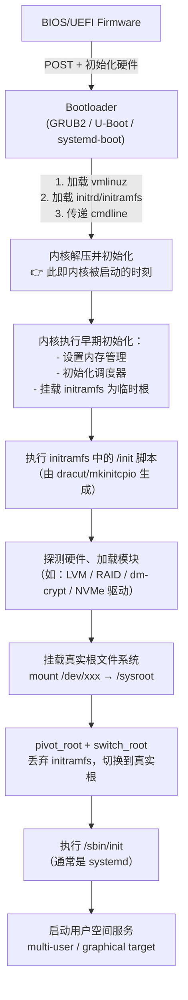
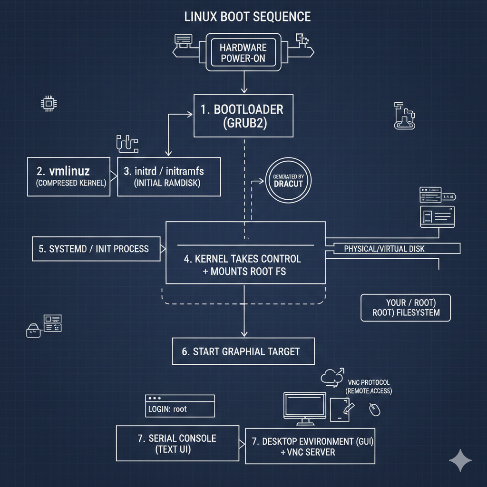

```
BIOS/UEFI
   ↓
GRUB2 as 引导加载器 (Bootloader [GRUB2/LILO] 1. Locate the operating system kernel on the disk 2. Load the kernel into computer's memory 3.Start running kernel codes ) -
   ↓
Linux 内核加载 + initramfs (Kernel take over computer resources)
1. It decompress itself into  meomory
2. Check the hardware
3. Load device driver, background processes and other kernel modules
4. Initial Process called init kicks-off called Systemd Nowaday before called SysV
   ↓
systemd（PID 1）- User Namespace
- systemd: systemctl, journalctl, notify, analyze, cgls, cgtop, loginctl nspawn
- systemd Daemons: systemd, journalctl, networkd, loginduser, session
- systemd Targets (bootmode, basic, shutdown, reboot)
- multi-user (dbus, telephony, dlog, logind)
- graphical: (User-session)
- user-session (display service tizen service)
- Linux Kernel (cgroups, autofs, kdbus)
   ↓
挂载文件系统、初始化服务、网络、用户空间
   ↓
TTY 或 图形界面
```
####  UEFI 系统会有这个目录：
ls /sys/firmware/efi

| 项目                | BIOS       | UEFI                  |
| ----------------- | ---------- | --------------------- |
| 引导方式              | 使用 MBR 分区表 | 使用 GPT 分区表            |
| 支持磁盘大小            | 最大 2.2TB   | 支持超过 9ZB（Zetta Bytes） |
| 启动速度              | 相对较慢       | 更快（并行初始化）             |
| 界面                | 文本模式       | 图形界面（支持鼠标）            |
| 可扩展性              | 有限         | 高度可扩展（可以加载驱动）         |
| 安全启动（Secure Boot） | 不支持        | 支持                    |
| 可编程性（Shell）       | 不支持        | 可进入 UEFI Shell        |


| 项目       | MBR             | GPT                   |
| -------- | --------------- | --------------------- |
| 最大支持磁盘容量 | 2 TB            | \~9.4 ZB（Zetta Bytes） |
| 最大分区数    | 4 个主分区（可扩展逻辑分区） | 通常支持 128 个分区          |
| 启动方式     | 仅支持 BIOS        | 支持 UEFI（并可向后兼容 BIOS）  |
| 分区标识     | 不唯一（使用编号）       | 使用 GUID（全局唯一标识符）      |
| 数据完整性    | 无校验             | 支持 CRC 校验和冗余备份        |
| 分区表位置    | 第0扇区            | 开头 + 结尾都有（冗余）         |
| 系统兼容性    | 老旧系统支持好         | 新系统兼容性好（Win 8+/Linux） |



### 图示：从引导加载器开始



这份流程说明将 Linux 启动分为 硬件层、引导层、内核层、系统层 四个阶段。

Linux 启动文字流程图
1. [硬件上电] → BIOS/UEFI 执行自检 (POST)。

2. [引导阶段] → 加载 Bootloader (如 GRUB2)2。

3. [准备阶段] → Bootloader 将 vmlinuz (内核) 和 initrd (临时驱动包) 加载到内存。

4. [内核解压] → 内核接管 CPU，利用 initrd 里的驱动识别并挂载真正的根文件系统 (Root FS)。

5. [初始化阶段] → 内核启动第一个进程 systemd (或 init)。

6. [用户层启动] → systemd 根据运行级别启动网络、服务、图形界面 (GUI) 及 VNC 协议。

7. [管理层进入] → 用户通过 Serial Console (文本) 或 VNC (图形) 登录。


## 关键概念、工具与交付物 (Artifacts) 详解

### 1) 引导与内核相关 (Boot & Kernel)

- **Bootloader（引导加载程序）**  
  说明：硬盘或固件上的小程序（如 `GRUB2`、`systemd-boot`、`U-Boot`），负责找到并加载 `vmlinuz` 与 `initrd`，并将 kernel cmdline 传递给内核。

- **vmlinuz（压缩内核镜像）**  
  说明：Linux 内核的可执行映像，包含内存管理、进程调度、中断和驱动接口等核心功能。

- **initrd / initramfs（初始内存磁盘）**  
  说明：一个运行在内存中的临时根文件系统，包含引导时需要的驱动与脚本，用于挂载最终根文件系统。

- **dracut（生成工具）**  
  说明：常用于生成 initramfs 的工具；当内核或硬件变更时需要重新生成。

### 2) 管理与自动化 (Management & Automation)

- **YaST**：SUSE 的系统管理与配置工具（图形/命令行），用于配置网络、分区、引导参数等。

- **AutoYaST**：无人值守安装方案，通过 XML 模板自动完成安装与配置。

### 3) 访问与交互 (Access)

- **Serial Console（串口控制台）**：最可靠的文本控制通道，适用于系统故障或没有网络时的救援访问。

- **VNC Protocol（远程桌面协议）**：用于图形会话的远程访问，通常在 GUI 登录后使用。

| 交付物名称 (Artifact) | 对应的物理文件位置 (典型路径) | 作用 |
| --- | --- | --- |
| 内核文件 | `/boot/vmlinuz-版本号` | 系统的核心引擎 |
| 驱动镜像 | `/boot/initrd-版本号` | 启动时必备的临时驱动库 |
| 引导配置 | `/boot/grub2/grub.cfg` | 指挥 Bootloader 如何加载内核的指令 |
| 自动化脚本 | `/root/autoyast.xml` | 记录自动化安装参数的文件 |


### D-Bus  
是一种进程间(IPC) 机制, 允许一个程序向另一个程序发送消息、调用功能或监听事件。 
2中类型
1. 系统总线（System Bus）
2. 会话总线（Session Bus） 

